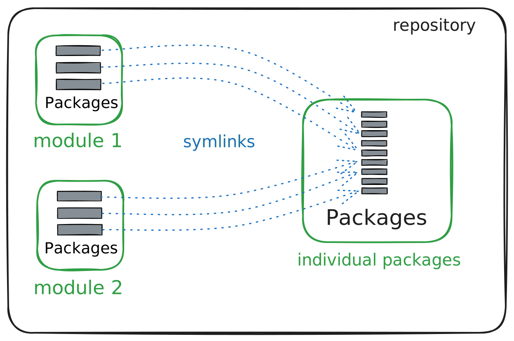

# Dotfiles repo 

## Repo structure 

<p align="center">
    
</p>

## Stow

This repo uses `stow` to manage the dotfiles.

### Modules 

The repo is meant to be used by modules that are stowed in the home directory.

To stow a module, use the following command:

```bash
stow <module>
```

For example to stow the `essential` module:

```bash
stow essential_module
```

### Individual packages

The repo was designed to be used by modules, but you can also stow individual packages since the modules are essentially just symbolic links to the individual packages.

To stow an individual package, use the following command:

```bash
cd individual_packages
stow -t ~/ <package>
```

To stow the `nvim` package:

```bash
cd individual_packages
stow -t ~/ nvim
```


