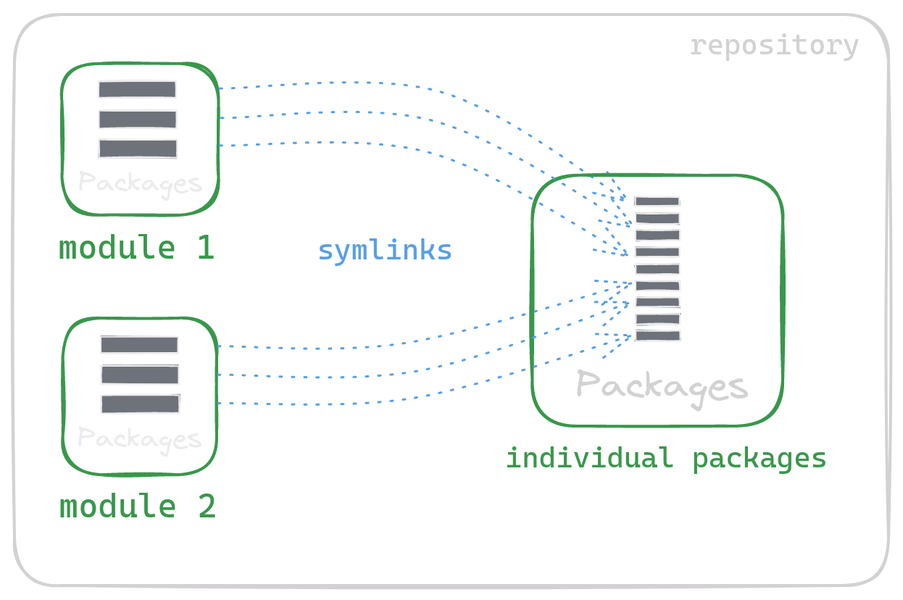

# Dotfiles repo 

## Table of contents

- [Gallery](#gallery)
  - [Desktop](#desktop)
- [Repo structure](#repo-structure)
- [Modules](#modules)
  - [Essential](#essential-packages-that-i-need-no-matter-which-system-im-using)
  - [Hyprland](#hyprland-config-files-related-to-hyprand)
  - [Pretty](#pretty-packages-that-make-my-system-look-pretty)
  - [Apps](#apps-miscellaneous-apps-that-i-use)
  - [Desktop](#desktop-this-is-kinda-a-backup-module-for-desktop-related-files)
- [Stow](#stow)

## Gallery

### Desktop

<p align="center">
    
</p>

## Repo structure 

<p align="center">
    
</p>

## Modules

### Essential: Packages that I need no matter which system I'm using.

- `zsh`: Zsh configuration files.
  - `.zshrc`: Zsh configuration file.
  - `.zsh_aliases`: Zsh aliases file.
  - `.zsh_env`: Zsh environment variables file.
- `nvim`: Neovim configuration files.

### Hyprland: Config files related to Hyprand

- `hypr`: Hypr configuration files.
  - `hyprland.conf`: Hypr configuration file.
  - `hyprpaper.conf`: Hypr wallpaper configuration file.
- `waybar`: Waybar configuration files.
  - `config.jsonc`: Waybar configuration file.
  - `style.css`: Waybar style file.
  - `modules_mux/modules_other`: Waybar modules files.

### Pretty: Packages that make my system look pretty.

- `starship`: Starship configuration files.
  - `starship.toml`: Starship configuration file.
- `fastfetch`: Fastfetch configuration files.
  - `config.jsonc`: Fastfetch configuration file.
  - `darkrai.png`: Fastfetch logo file.

### Apps: Miscellaneous apps that I use.

- `kitty`: Kitty configuration files.
  - `kitty.conf`: Kitty configuration file.

### Desktop: This is kinda a backup module for desktop related files.

- `scripts`: Scripts.
- `Wallpapers`: Wallpapers.

## Stow

This repo uses `stow` to manage the dotfiles.

### Modules 

The repo is meant to be used as a collection of modules so the "easier" way to use it is to just stow the whole module.

To stow a module, use the following command:

```bash
stow <module>
```

For example to stow the `essential` module:

```bash
stow essential_module
```

### Individual packages

The repo was designed to be used by modules, but you can also stow individual packages since the modules are essentially just symbolic links to the individual packages.

To stow an individual package, use the following command:

```bash
cd individual_packages
stow -t ~/ <package>
```

For example to stow the `nvim` package:

```bash
cd individual_packages
stow -t ~/ nvim
```
